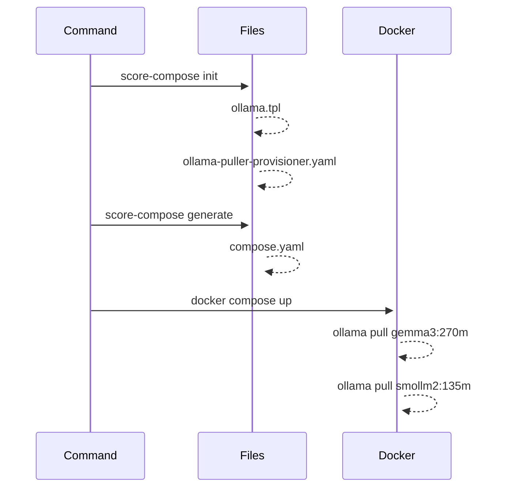
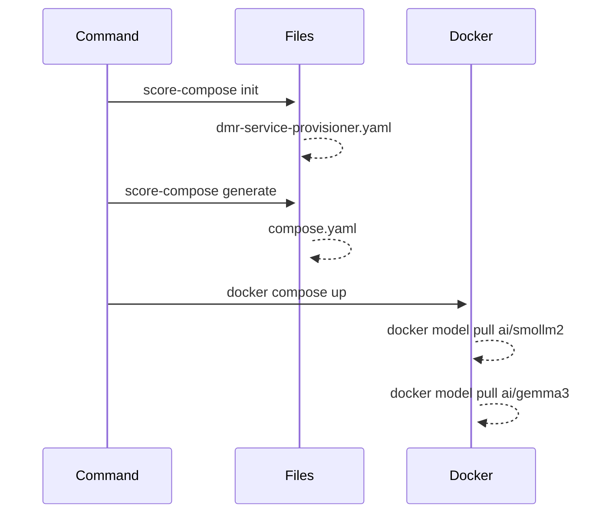

# sample-score-genai-app

- [`hello-genai-in-go`](./hello-genai-in-go/)
- [`open-webui`](./open-webui/)

TODOs:
- [ ] Codespace setup with DMR
- [ ] Kubernetes
  - https://docs.docker.com/ai/model-runner/api-reference/
  - https://github.com/AdminTurnedDevOps/agentic-demo-repo/blob/main/kagent-oss/llama-k8s-agentic/setup-llama.md
  - https://github.com/docker/model-runner/blob/main/charts/docker-model-runner/templates/deployment.yaml
  - https://k33g.hashnode.dev/first-contact-with-docker-model-runner-in-golang#heading-run-the-program-using-docker-compose
  - https://github.com/Reshrahim/todoapp-ai/blob/main/recipes/kubernetes-llama/main.tf
  - https://github.com/docker/compose-bridge-transformer

With Ollama:

With DMR:

## Resources:

- https://github.com/docker/hello-genai
- https://k33g.hashnode.dev/first-contact-with-docker-model-runner-in-golang
- https://dev.to/ajeetraina/docker-model-runner-cheatsheet-2025-37nd
- https://www.docker.com/blog/local-llm-tool-calling-a-practical-evaluation/
